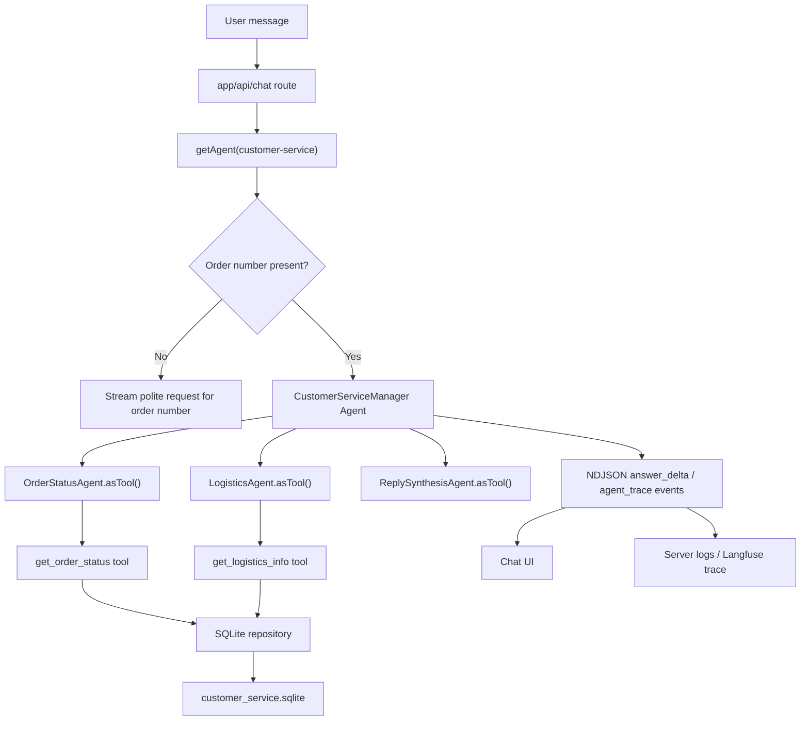

# chat-site v0.5.0 - Customer Service Multi-Agent Workflow

**Status:** draft (2026-04-26)
**Source brief:** `/Users/snow/Documents/Repository/ai-engineer-training/projects/project1_2/项目描述.txt`
**Target app:** `projects/chat-site`
**Primary constraint:** Use the OpenAI Agents SDK for agent orchestration. Do not use AutoGen, LangChain, or another agent framework.

## 1. Goal

Add a customer-service multi-agent workflow for the question:

> 我的订单为什么还没发货？

The system must:

- Ask for an order number first when the latest user turn does not contain one.
- Use OpenAI Agents SDK multi-agent orchestration once an order number is available.
- Query order status and logistics status from a SQLite-backed production data layer.
- Automatically retry transient internal lookup failures with exponential backoff.
- Show the agent interaction process in the chat UI when `SHOW_AGENT_TRACE` is enabled.
- Keep the same trace details in server logs / traces even when UI trace display is disabled.

## 2. Locked decisions

| Decision | Choice |
|---|---|
| App target | Existing Next.js + TypeScript `chat-site` app |
| Agent framework | `@openai/agents` only |
| Multi-agent pattern | Manager agent with specialist agents exposed via `agent.asTool()` |
| Specialist agents | Agent A: order status, Agent B: logistics status, Agent C: reply synthesis |
| Missing order number | Deterministic preflight asks the user for an order number; no SDK/model call |
| Persistence | SQLite is the real order/logistics DB for local + production on a persistent Node host |
| SQLite scope | Runtime reads order/logistics data; schema/seed scripts handle writes |
| Serverless caveat | File-based SQLite is not suitable for Vercel/serverless; use hosted SQLite/libSQL or another external DB there |
| Trace UI flag | `SHOW_AGENT_TRACE`, default `true`; `false` means logs/traces only |
| Retry policy | Separate internal lookup retry, max 3 attempts, exponential backoff with jitter |
| Existing agents | `general` and `qa-coach` keep current behavior |

## 3. User behavior

### No order number

User:

> 我的订单为什么还没发货？

Assistant:

> 请提供订单号，我帮你查询发货状态。

This branch is deterministic. It does not call the model, SQLite, or internal tools.

### With order number

User:

> 我的订单 1001 为什么还没发货？

Assistant flow:

1. Parse `1001` as the order number.
2. Run `CustomerServiceManager`.
3. Manager calls `OrderStatusAgent` as a tool.
4. Manager calls `LogisticsAgent` as a tool.
5. Manager calls `ReplySynthesisAgent` as a tool with the two results.
6. Manager streams the final Chinese customer-service answer.
7. Server emits/logs agent-trace events for each major step.

The final answer should explain the current order state, logistics state, likely reason for not shipping, and a concrete next step. It should not expose raw database fields unless they are user-meaningful.

## 4. Architecture



The manager owns the user-facing conversation. Specialists do bounded work behind the manager and do not take over the chat. This follows the Agents SDK guidance for using agents as tools when a specialist should assist another agent without owning the conversation.

## 5. OpenAI Agents SDK usage

Use these SDK capabilities:

- `Agent` for manager and specialist definitions.
- `tool()` for local database lookup tools.
- `agent.asTool()` for order, logistics, and reply specialist agents.
- Streaming `Runner.run(..., { stream: true })` for final answer text.
- SDK stream events (`run_item_stream_event`, `agent_updated_stream_event`, and nested `agent.asTool()` streaming callbacks) for trace extraction.
- Built-in SDK tracing when enabled by the provider/runtime, plus existing app logging.

Do not introduce any other orchestration framework.

Implementation detail: the customer-service runner should consume the full SDK stream when trace display is enabled. If the SDK/provider cannot safely expose both `toTextStream()` and full event iteration from the same run, derive `answer_delta` from the full stream and avoid double-consuming the stream.

References:

- Agents as tools: https://openai.github.io/openai-agents-js/guides/tools/#4-agents-as-tools
- Streaming events: https://openai.github.io/openai-agents-js/guides/streaming/
- Handoffs comparison: https://openai.github.io/openai-agents-js/guides/handoffs/
- Tracing: https://openai.github.io/openai-agents-js/guides/tracing/

## 6. Module layout

```text
projects/chat-site/
├── app/
│   └── api/
│       └── chat/route.ts                         EDIT: env includes trace flag; delegates via existing runAgent
├── data/
│   └── customer-service/
│       ├── schema.sql                            NEW: SQLite schema
│       └── seed.sql                              NEW: deterministic demo data
├── scripts/
│   └── seed-customer-service-db.mjs              NEW: creates/seeds SQLite DB
├── lib/
│   ├── agents/
│   │   ├── customer-service.ts                   NEW: public agent spec
│   │   ├── customer-service-workflow.ts          NEW: SDK manager + specialist builders
│   │   └── index.ts                              EDIT: register customer-service
│   ├── chat/
│   │   ├── run-agent.ts                          EDIT: dispatch custom customer-service runner
│   │   └── stream-event.ts                       EDIT: add agent_trace event
│   ├── config/
│   │   └── env.ts                                EDIT: db path + trace flag
│   ├── customer-service/
│   │   ├── order-number.ts                       NEW: pure order-number extraction
│   │   ├── repository.ts                         NEW: repository interface + mapping helpers
│   │   ├── sqlite-repository.ts                  NEW: SQLite effect boundary
│   │   ├── retry.ts                              NEW: backoff policy + retry executor
│   │   ├── trace.ts                              NEW: trace event normalization
│   │   └── runner.ts                             NEW: custom workflow runner
│   └── prompts/
│       └── customer-service.ts                   NEW: manager + specialist prompts
├── components/
│   └── chat/
│       ├── message-bubble.tsx                    EDIT: render trace timeline
│       └── agent-trace.tsx                       NEW: compact timeline component
├── tests/
│   ├── lib/customer-service/*.test.ts            NEW: pure + repository + retry tests
│   ├── lib/agents/customer-service*.test.ts      NEW: SDK wiring tests
│   └── app/api/chat/customer-service-route.test.ts NEW: route behavior
├── .env.example                                  EDIT: CUSTOMER_SERVICE_DB_PATH, SHOW_AGENT_TRACE
├── package.json                                  EDIT: seed script if needed
└── README.md                                     EDIT: customer-service setup and deployment notes
```

## 7. SQLite design

### 7.1 Database path

Add:

```env
CUSTOMER_SERVICE_DB_PATH=data/customer-service/customer-service.sqlite
SHOW_AGENT_TRACE=true
```

`SHOW_AGENT_TRACE` defaults to `true` when omitted.

`CUSTOMER_SERVICE_DB_PATH` must point to a writable persistent disk in production. For local development, the seed script can create the database under `data/customer-service/`.

### 7.2 Driver choice

Use a small repository interface so the driver is isolated. Prefer Node's built-in `node:sqlite` in this repo because the project already requires Node 22 and this avoids adding an ORM or extra database dependency.

The repository interface keeps the rest of the workflow independent from the driver:

```ts
export type CustomerServiceRepository = {
  findOrderById: (orderId: string) => Promise<OrderRecord | null>;
  findLogisticsByOrderId: (orderId: string) => Promise<LogisticsRecord | null>;
};
```

Runtime code should open the database at the effect boundary and pass the repository explicitly into lookup tools. Avoid hidden global mutable state. Tests can create temp SQLite files using the same schema.

If `node:sqlite` is not acceptable in a target production runtime, only `sqlite-repository.ts` should change. The agents, retry logic, route, tests around behavior, and repository interface stay the same.

### 7.3 Schema

```sql
CREATE TABLE orders (
  order_id TEXT PRIMARY KEY,
  customer_name TEXT,
  status TEXT NOT NULL,
  payment_status TEXT NOT NULL,
  paid_at TEXT,
  promised_ship_by TEXT,
  hold_reason TEXT,
  warehouse TEXT,
  sku_summary TEXT NOT NULL,
  updated_at TEXT NOT NULL
);

CREATE TABLE shipments (
  order_id TEXT PRIMARY KEY REFERENCES orders(order_id),
  carrier TEXT,
  tracking_number TEXT,
  status TEXT NOT NULL,
  shipped_at TEXT,
  estimated_delivery_at TEXT,
  latest_location TEXT,
  exception_reason TEXT,
  updated_at TEXT NOT NULL
);

CREATE TABLE logistics_events (
  id INTEGER PRIMARY KEY AUTOINCREMENT,
  order_id TEXT NOT NULL REFERENCES orders(order_id),
  event_time TEXT NOT NULL,
  event_code TEXT NOT NULL,
  event_label TEXT NOT NULL,
  location TEXT,
  detail TEXT
);

CREATE INDEX idx_logistics_events_order_time
ON logistics_events(order_id, event_time DESC);
```

Seed examples should cover:

- Paid order waiting for warehouse pick.
- Order on stock hold.
- Shipped order with logistics events.
- Unknown order path.
- Logistics exception path.

### 7.4 Deployment note

File-based SQLite is valid only when the production runtime has a persistent writable filesystem, for example a single Node server, VM, or Docker container with a mounted volume.

It is not a fit for Vercel/serverless deployments because serverless filesystems are ephemeral/read-only for durable app data. Vercel's own SQLite guidance says file-based SQLite cannot be used there and recommends other storage solutions. If this app is deployed to Vercel, use hosted SQLite/libSQL such as Turso or another external DB behind the same repository interface.

Reference: https://vercel.com/kb/guide/is-sqlite-supported-in-vercel

## 8. Agent roles and prompts

### CustomerServiceManager

Purpose: own the user-facing turn and orchestrate the specialists.

Instructions:

- Use the provided order number.
- Call `order_status_agent` to understand order state.
- Call `logistics_agent` to understand shipping/logistics state.
- Call `reply_synthesis_agent` to compose the final answer.
- Return the final reply in Chinese.
- Do not invent facts not returned by tools.
- If tools disagree, state what is known and what needs manual follow-up.

### Agent A: OrderStatusAgent

Purpose: query and summarize order status.

Tool:

- `get_order_status({ orderId })`

Output contract:

```json
{
  "orderId": "1001",
  "found": true,
  "status": "paid_waiting_fulfillment",
  "paymentStatus": "paid",
  "promisedShipBy": "2026-04-27T18:00:00+08:00",
  "holdReason": null,
  "warehouse": "Shanghai-01",
  "summary": "订单已付款，正在等待仓库拣货。"
}
```

### Agent B: LogisticsAgent

Purpose: query and summarize logistics status.

Tool:

- `get_logistics_info({ orderId })`

Output contract:

```json
{
  "orderId": "1001",
  "found": true,
  "shipmentStatus": "not_shipped",
  "carrier": null,
  "trackingNumber": null,
  "latestEvent": null,
  "exceptionReason": null,
  "summary": "暂未生成物流单号，说明订单还没有出库。"
}
```

### Agent C: ReplySynthesisAgent

Purpose: turn Agent A + Agent B results into the customer-facing answer.

Input:

- User question.
- Order number.
- Order status summary.
- Logistics status summary.

Output:

- Concise Chinese answer.
- Explain why the order has not shipped.
- Include next step and expected timing when available.
- Apologize only when there is a service issue or delay; avoid empty apology boilerplate.

## 9. Data flow

```text
Input message
  -> extractOrderNumber(latestUserMessage)
  -> if missing: deterministic answer
  -> build customer-service repository from env
  -> build trace emitter from env
  -> build manager + specialist agents
  -> Runner.run(manager, conversationInput, { stream: true })
  -> map SDK stream events to:
       - answer_delta for user-facing text
       - agent_trace for visible interaction steps
       - retrying / failed / done for existing lifecycle
  -> always log normalized trace entries server-side
```

The chat API remains stateless for conversation history. SQLite stores order/logistics business data, not chat history.

## 10. Trace design

Add a stream event:

```ts
export type AgentTraceEvent = {
  eventId: string;
  kind: "agent_trace";
  attemptId: number;
  ts: number;
  agentId: string;
  phase:
    | "manager_started"
    | "specialist_started"
    | "tool_called"
    | "retry_scheduled"
    | "tool_succeeded"
    | "tool_failed"
    | "specialist_completed"
    | "manager_completed";
  label: string;
  summary: string;
  metadata?: {
    orderId?: string;
    toolName?: string;
    attempt?: number;
    nextDelayMs?: number;
  };
};
```

Rules:

- Emit to the client only when `SHOW_AGENT_TRACE !== false`.
- Always write trace entries to `getLogger()` with the server trace id.
- Do not include API keys, raw prompts, raw tool arguments beyond order id, or full customer records.
- UI renders a compact collapsible timeline attached to the assistant message.
- If the SDK stream shape differs between providers, keep the UI stable by normalizing SDK events plus tool wrapper callbacks into this app-level event.

## 11. Retry and error handling

There are two retry layers:

1. Existing outer LLM/provider retry in `runAgent`.
2. New internal lookup retry for SQLite/internal API boundaries.

Internal retry policy:

```ts
maxAttempts: 3
baseDelayMs: 200
maxDelayMs: 1500
jitter: 0-100ms
retryable:
  - SQLITE_BUSY
  - SQLITE_LOCKED
  - timeout
  - transient network failure if an HTTP adapter is later added
nonRetryable:
  - order_not_found
  - invalid_order_id
  - schema/configuration errors
```

The retry executor takes `sleep` and `now` dependencies so tests are deterministic.

Failure behavior:

- Unknown order: final answer says the order number was not found and asks the user to confirm it.
- Order found, logistics missing: explain that no logistics record exists yet and use the order status as the source of truth.
- SQLite unavailable after retries: final answer apologizes and says the order system is temporarily unavailable.
- Specialist failure: manager still produces a bounded answer from available data and names the missing lookup.

## 12. Testing plan

Follow TDD. Add failing tests before implementation.

Unit tests:

- `extractOrderNumber` handles Chinese, English, `#1001`, whitespace, and no-match cases.
- SQLite mapping functions convert DB rows into domain records without mutation.
- Retry policy retries transient errors, stops on non-retryable errors, and computes delays deterministically.
- Trace normalizer maps SDK/tool events into stable `agent_trace` events.

Repository tests:

- Seed a temp SQLite DB from `schema.sql`.
- Query existing order.
- Query missing order.
- Query shipment with latest logistics event.
- Query shipment missing logistics.

Agent wiring tests:

- `customer-service` appears in the agent registry and public `/api/agents` response.
- Manager includes three specialist agent tools.
- Specialist agents include only their intended database tool.
- Prompts forbid invented facts.

Route/runner tests:

- Missing order number streams the deterministic request for order number and does not call SDK.
- Order-number request calls the customer-service runner.
- `SHOW_AGENT_TRACE=true` streams trace events.
- `SHOW_AGENT_TRACE=false` suppresses client trace events but still logs trace entries.
- Internal transient failures produce retry trace events.

UI tests:

- Reducer stores `agent_trace` events on the current assistant message.
- Message bubble renders a compact timeline when traces exist.
- Existing general/qa-coach conversations still render normally.

Manual smoke test:

```bash
pnpm seed:customer-service-db
pnpm test
pnpm typecheck
pnpm lint
pnpm dev
```

Then ask:

- `我的订单为什么还没发货？`
- `我的订单 1001 为什么还没发货？`
- `帮我查一下订单 #9999 的物流`

## 13. Risks and mitigations

| Risk | Mitigation |
|---|---|
| File-based SQLite used on serverless | Document persistent-host requirement; isolate DB behind repository so hosted SQLite can replace it |
| Manager skips a specialist tool | Strong manager prompt plus tests over SDK construction; trace gaps make this visible |
| SDK stream events vary by provider | Normalize events into app-level `agent_trace`; use tool wrapper callbacks for critical retry/tool steps |
| SQLite busy under writes | Runtime is read-only for this workflow; seed/migrations happen outside chat requests; retry `SQLITE_BUSY` |
| Trace leaks sensitive data | Whitelist metadata fields and never stream raw DB rows or prompts |
| Existing agents regress | Custom runner dispatch is scoped to `customer-service`; default runner path stays unchanged |

## 14. Non-goals

- User authentication or order ownership verification.
- Real carrier API integration.
- Admin UI for editing orders.
- Chat history persistence.
- Multi-tenant database design.
- AutoGen compatibility.
