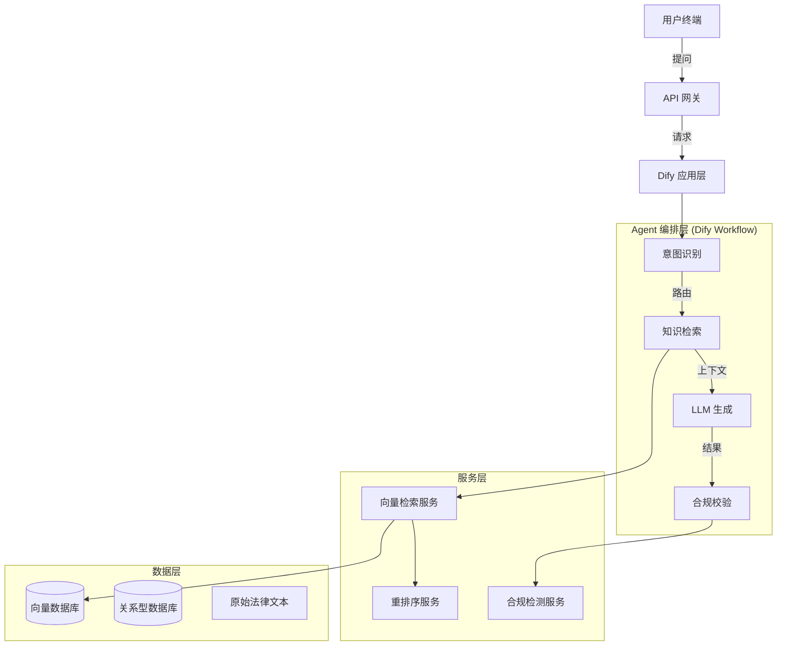

# 法律咨询 Agent 技术方案设计文档 (TDD)

| 文档版本 | 修改日期 | 修改人 | 修改内容 |
| :--- | :--- | :--- | :--- |
| V1.0 | 2026-02-01 | Trae | 初始版本创建 |

## 1. 引言

### 1.1 目的
本文档旨在根据《法律咨询 Agent 产品需求文档 (PRD)》的定义，明确系统的技术实现方案。重点阐述系统架构、关键技术选型、模块设计及数据流转逻辑，为开发实施提供指导。

### 1.2 范围
本文档覆盖法律知识库构建、混合检索系统、Dify Agent 编排及合规性控制等核心模块的设计。

---

## 2. 系统架构设计

### 2.1 总体逻辑架构
系统采用分层架构设计，自下而上分为：数据层、服务层、Agent 编排层和应用层。



### 2.2 核心技术选型
*   **LLM 基座**：DeepSeek-V3 / GPT-4o (兼顾推理能力与成本)
*   **Agent 框架**：Dify (利用其 Workflow 和 RAG 管道能力)
*   **向量数据库**：Milvus / Weaviate (支持高性能混合检索)
*   **Embedding 模型**：BGE-M3 (支持长文本和多语言，适合法律文档)
*   **Rerank 模型**：BGE-Reranker-v2-m3
*   **开发语言**：Python 3.12+

---

## 3. 核心模块详细设计

### 3.1 法律知识库构建 (Knowledge Base)

#### 3.1.1 数据预处理流程
1.  **清洗 (Cleaning)**：
    *   去除 HTML 标签、特殊符号。
    *   正则提取法条结构：`编-章-节-条`。
    *   案例提取关键要素：`案号`、`案由`、`裁判要旨`、`基本案情`。
2.  **分块 (Chunking)**：
    *   **法条**：按“条”为最小粒度，保留层级路径作为 Metadata（例如：`《民法典》-婚姻家庭编-第一千零六十二条`）。
    *   **案例**：采用 RecursiveCharacterTextSplitter，Chunk Size = 512 tokens，Overlap = 100 tokens。
3.  **向量化 (Embedding)**：
    *   使用 BGE-M3 模型将文本转换为 Dense Vector。
    *   同时生成 Sparse Vector (SPLADE) 用于关键词检索（如果向量库支持）。

#### 3.1.2 向量库 Schema 设计
**Collection: Law_Articles (法条库)**
| Field Name | Type | Description |
| :--- | :--- | :--- |
| id | Int64 | 主键 ID |
| content | VarChar | 法条正文 |
| vector | FloatVector | 768/1024 维向量 |
| law_name | VarChar | 法律名称 (如《民法典》) |
| chapter | VarChar | 章节路径 |
| article_no | VarChar | 条款号 |
| effect_date | Int64 | 生效时间戳 |

**Collection: Law_Cases (案例库)**
| Field Name | Type | Description |
| :--- | :--- | :--- |
| id | Int64 | 主键 ID |
| content | VarChar | 案情/裁判片段 |
| vector | FloatVector | 向量 |
| case_no | VarChar | 案号 |
| cause | VarChar | 案由 |
| court_level | VarChar | 法院层级 |

### 3.2 智能检索系统 (Retrieval System)

#### 3.2.1 混合检索策略 (Hybrid Search)
为了解决法律术语精确匹配和语义理解的矛盾，采用“关键词 + 语义”混合检索。
*   **流程**：
    1.  **Query Rewrite**：将用户口语化提问重写为法律规范查询语句。
    2.  **Keyword Search**：使用 BM25 算法检索精确匹配的法条/案例。
    3.  **Vector Search**：使用 Embedding 检索语义相关的法条/案例。
    4.  **Fusion**：使用 RRF (Reciprocal Rank Fusion) 算法合并两路结果。

#### 3.2.2 重排序 (Reranking)
*   对 Fusion 后的 Top-50 结果进行 Rerank。
*   使用 BGE-Reranker 模型计算 `(Query, Document)` 的相关性分数。
*   截取 Score > 0.7 的 Top-5 结果作为最终 Context。

### 3.3 Agent 编排与 Prompt 设计

#### 3.3.1 Dify Workflow 设计
1.  **Start 节点**：接收用户 Query。
2.  **意图分类节点 (LLM)**：
    *   分类标签：`婚姻家庭`、`劳动纠纷`、`刑事犯罪`、`合同纠纷`、`其他`。
3.  **知识检索节点 (Knowledge Retrieval)**：
    *   根据分类路由到不同的知识库 Collection。
    *   执行混合检索 + Rerank。
4.  **LLM 生成节点 (LLM)**：
    *   输入：`User Query` + `Retrieved Context`。
    *   输出：结构化回答。
5.  **合规检查节点 (Code/LLM)**：
    *   检查输出是否包含敏感词。
6.  **End 节点**：返回最终回答。

#### 3.3.2 Prompt 模板 (System Prompt)
```markdown
# Role
你是一名资深的中国法律顾问，专注于根据提供的法律依据回答用户问题。

# Constraints
1. 必须严格基于提供的 [Context] 回答，严禁编造法条或案例。
2. 如果 [Context] 中没有相关信息，请直接回答“根据现有知识库无法回答此问题”，不要强行回答。
3. 回答必须客观、中立，符合中国法律法规。

# Output Format
请按照以下结构组织回答：
1. **核心结论**：直接回答用户问题的结论。
2. **法律依据**：引用 [Context] 中的具体法条（需注明法律名称和条款号）。
3. **案例参考**：如果 [Context] 中有相关案例，简要概括案情和判决结果。
4. **实务建议**：给出具体的操作建议（如证据收集、诉讼时效等）。
5. **免责声明**：(固定文案：本回复仅供参考，不构成正式法律意见...)

# Context
{{context}}

# User Question
{{query}}
```

### 3.4 合规性控制模块

#### 3.4.1 输入侧护栏
*   **敏感词库匹配**：建立包含政治敏感、暴力恐怖、黄赌毒等词汇的 Trie 树，并在 API 网关层进行拦截。
*   **意图识别拦截**：如果识别出用户意图为“如何逃避法律制裁”、“如何实施犯罪”等，直接拒绝回答。

#### 3.4.2 输出侧护栏
*   **关键词过滤**：检查生成的回答中是否包含敏感词。
*   **合规性检测模型**：使用轻量级分类模型（如 BERT-Tiny）判断回答是否包含诱导违法内容。

---

## 4. 接口设计 (API Specification)

### 4.1 咨询对话接口
*   **Endpoint**: `POST /v1/chat-messages`
*   **Request Body**:
    ```json
    {
      "query": "离婚财产如何分割？",
      "user_id": "user_12345",
      "conversation_id": "conv_abcde",
      "inputs": {}
    }
    ```
*   **Response Body**:
    ```json
    {
      "event": "message",
      "answer": "根据《民法典》第一千零六十二条...",
      "metadata": {
        "retrieved_documents": [
          {
            "source": "《民法典》",
            "score": 0.89,
            "content": "夫妻在婚姻关系存续期间所得的下列财产..."
          }
        ]
      },
      "created_at": 1712345678
    }
    ```

---

## 5. 部署与运维

### 5.1 部署架构
*   **Dify 服务**：Docker Compose / K8s 部署。
*   **向量库**：独立部署 Milvus Cluster。
*   **Embedding/Rerank 模型**：使用 Xinference 或 vLLM 部署为 OpenAI 兼容 API。

### 5.2 监控告警
*   监控指标：QPS、平均响应时间 (RT)、Token 消耗量、检索命中率。
*   告警阈值：RT > 10s，错误率 > 1%。
